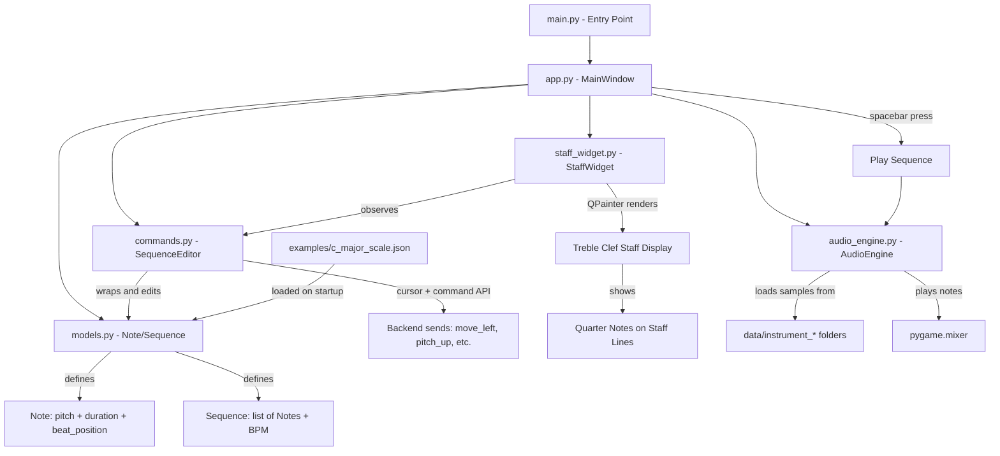
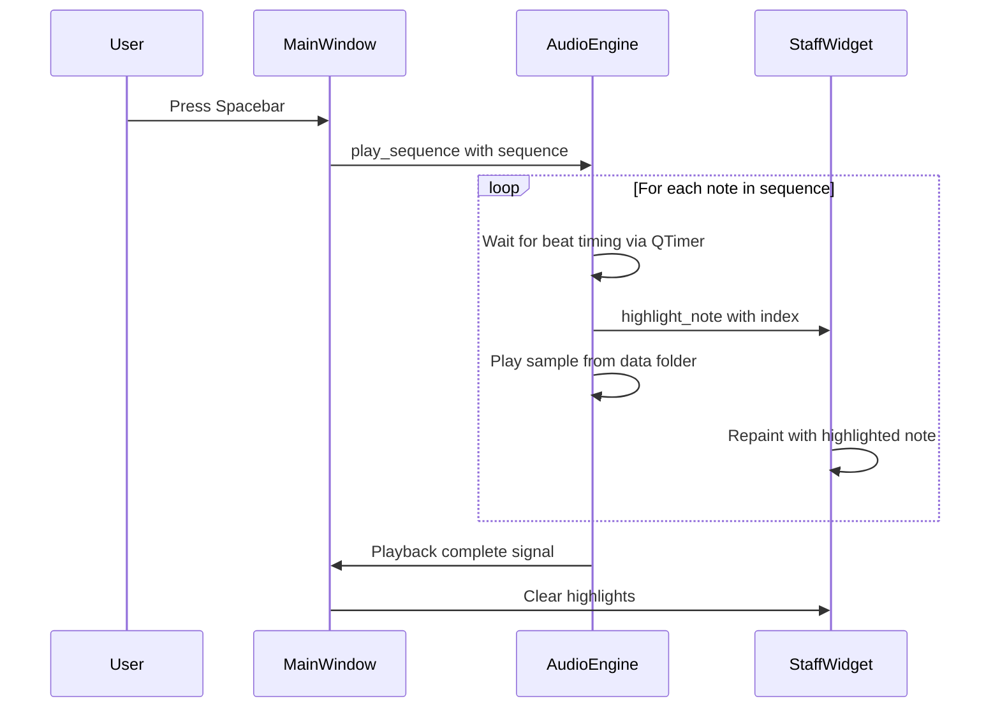

# Music Production App - Architecture Plan

## Overview
A PyQt6-based music production app that displays notes on a treble clef staff and plays instrument samples. The app starts with a pre-loaded C major scale example and supports spacebar-triggered playback.

## Tech Stack
- **Python 3.11+** via `uv` package manager
- **PyQt6** - GUI framework
- **pygame** - Audio playback (reliable MP3/WAV support)
- **numpy** - Sine wave generation for placeholder samples
- **scipy** - WAV file writing for generated samples

## Project Structure

```
music-app/
├── pyproject.toml              # uv project config
├── README.md
├── data/
│   ├── instrument_c/
│   │   └── c4.wav              # placeholder sine wave
│   ├── instrument_c_sharp/
│   │   └── c_sharp4.wav
│   ├── instrument_d/
│   │   └── d4.wav
│   ├── instrument_d_sharp/
│   │   └── d_sharp4.wav
│   ├── instrument_e/
│   │   └── e4.wav
│   ├── instrument_f/
│   │   └── f4.wav
│   ├── instrument_f_sharp/
│   │   └── f_sharp4.wav
│   ├── instrument_g/
│   │   └── g4.wav
│   ├── instrument_g_sharp/
│   │   └── g_sharp4.wav
│   ├── instrument_a/
│   │   └── a4.wav
│   ├── instrument_a_sharp/
│   │   └── a_sharp4.wav
│   ├── instrument_b/
│   │   └── b4.wav
│   └── instrument_c5/
│       └── c5.wav              # C5 for the scale top
├── examples/
│   └── c_major_scale.json      # Pre-built C major scale sequence
├── src/
│   └── music_app/
│       ├── __init__.py
│       ├── main.py             # Entry point
│       ├── app.py              # QMainWindow - main application window
│       ├── staff_widget.py     # QWidget - treble clef staff rendering
│       ├── audio_engine.py     # Audio playback engine
│       ├── models.py           # Note data model
│       ├── commands.py         # SequenceEditor - command interface for backend
│       └── generate_samples.py # Script to generate placeholder WAV files
```

## Architecture Diagram



## Component Details

### 1. Note Data Model - models.py
```python
@dataclass
class Note:
    pitch: str        # e.g. 'C4', 'D4', 'E4'
    duration: float   # in beats, 1.0 = quarter note
    beat: float       # position in sequence, starting from 0

@dataclass
class Sequence:
    notes: list[Note]
    bpm: int          # tempo, default 120
    name: str
```

### 1b. Command Interface - commands.py
A command dispatcher that exposes simple string-based commands for future backend integration.
The Sequence maintains a `cursor` (selected note index) so commands know which note to act on.

```python
class SequenceEditor:
    """Wraps a Sequence and provides an edit cursor + command API.
    
    Designed so a backend can send simple command strings
    like 'move_left', 'move_right', 'pitch_up', 'pitch_down'.
    """
    def __init__(self, sequence: Sequence):
        self.sequence = sequence
        self.cursor: int = 0  # index of selected note

    def execute(self, command: str) -> None:
        """Dispatch a command string to the appropriate method."""
        actions = {
            'move_left': self.move_left,
            'move_right': self.move_right,
            'pitch_up': self.pitch_up,
            'pitch_down': self.pitch_down,
            'delete_note': self.delete_note,
            'add_note': self.add_note,
        }
        if command in actions:
            actions[command]()

    def move_left(self) -> None: ...
    def move_right(self) -> None: ...
    def pitch_up(self) -> None: ...    # shift selected note up one semitone
    def pitch_down(self) -> None: ...  # shift selected note down one semitone
    def delete_note(self) -> None: ...
    def add_note(self) -> None: ...    # insert note at cursor
```

This design means the future backend only needs to call `editor.execute('pitch_up')` — no knowledge of the internal model is required. The `StaffWidget` will observe the `SequenceEditor` to reflect cursor position and any changes.

### 2. Audio Engine - audio_engine.py
- Initializes `pygame.mixer`
- Scans `data/` directory for `instrument_*` folders
- Loads sample files into a dictionary keyed by note name
- `play_note(pitch)` - triggers a single sample
- `play_sequence(sequence)` - plays notes in order using a QTimer for timing
- Supports MP3 and WAV formats (user can drop in MP3s later)

### 3. Staff Widget - staff_widget.py
- Custom `QWidget` using `QPainter` for rendering
- Draws 5 horizontal staff lines
- Draws treble clef symbol (using a pre-drawn path or Unicode glyph with a music font)
- Positions notes on correct staff lines/spaces:
  - **C4**: below first ledger line (one ledger line below staff)
  - **D4**: just below first staff line
  - **E4**: on first staff line
  - **F4**: first space
  - **G4**: second line
  - **A4**: second space
  - **B4**: third line
  - **C5**: third space
- Notes rendered as filled oval + stem (quarter note style)
- Highlights currently playing note during playback

### 4. Main Window - app.py
- `QMainWindow` containing the `StaffWidget`
- Status bar showing current state (Ready / Playing)
- Keyboard shortcut: **Space** to play/stop
- Loads the example sequence on startup from `examples/c_major_scale.json`

### 5. Sample Generator - generate_samples.py
- Standalone script run once to create placeholder WAV files
- Generates sine waves at correct frequencies for each note:
  - C4=261.63Hz, D4=293.66Hz, E4=329.63Hz, F4=349.23Hz
  - G4=392.00Hz, A4=440.00Hz, B4=493.88Hz, C5=523.25Hz
  - Plus all sharps for completeness
- Each sample: 1 second duration, 44100Hz sample rate, 16-bit
- Saves to appropriate `data/instrument_*` folders

### 6. Example File - c_major_scale.json
```json
{
  "name": "C Major Scale",
  "bpm": 120,
  "notes": [
    {"pitch": "C4", "duration": 1.0, "beat": 0.0},
    {"pitch": "D4", "duration": 1.0, "beat": 1.0},
    {"pitch": "E4", "duration": 1.0, "beat": 2.0},
    {"pitch": "F4", "duration": 1.0, "beat": 3.0},
    {"pitch": "G4", "duration": 1.0, "beat": 4.0},
    {"pitch": "A4", "duration": 1.0, "beat": 5.0},
    {"pitch": "B4", "duration": 1.0, "beat": 6.0},
    {"pitch": "C5", "duration": 1.0, "beat": 7.0}
  ]
}
```

## Playback Flow



## Note Position Mapping on Treble Clef

```
----------- C5  (third space)
===== 3rd line ===== B4
----------- A4  (second space) 
===== 2nd line ===== G4
----------- F4  (first space)
===== 1st line ===== E4
----------- D4  (below first line)
--- C4 ---  (ledger line below staff)
```

## Dependencies (pyproject.toml)
- `PyQt6 >= 6.6`
- `pygame >= 2.5`
- `numpy >= 1.26`
- `scipy >= 1.12`

## Future Extensibility
- The data folder structure supports swapping instruments by replacing sample files
- The sequence model supports adding different note durations later
- The staff widget can be extended with editing tools (click to add/remove notes)
- Multiple octaves can be supported by adding more sample folders
